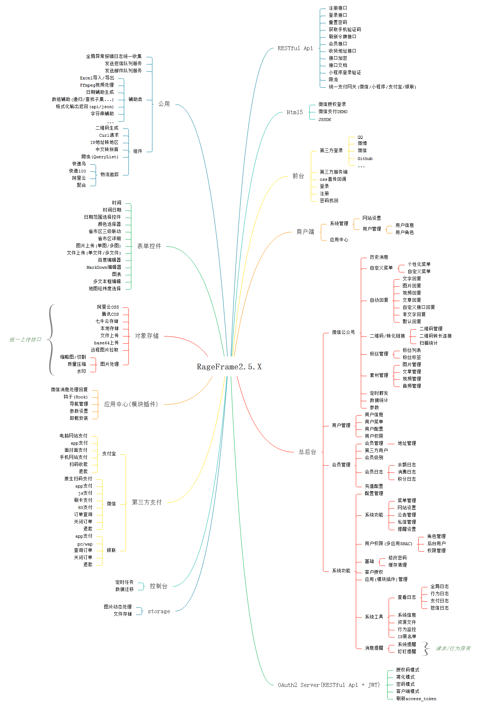
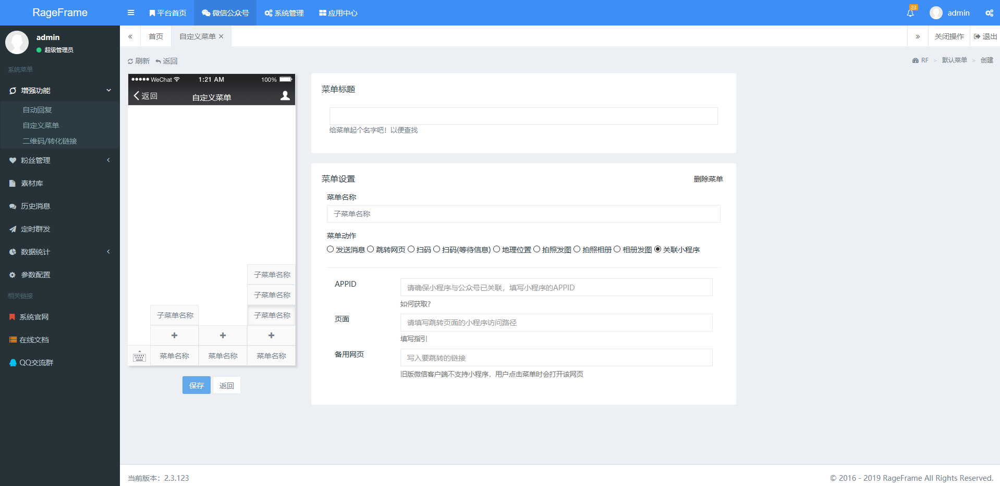
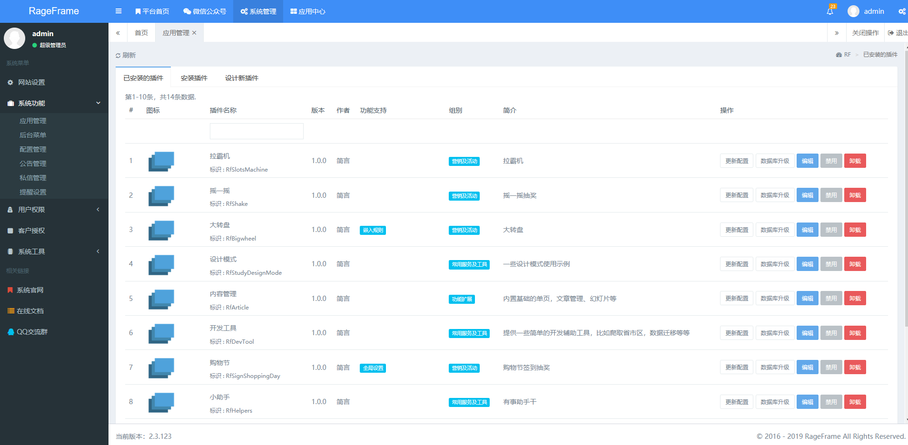
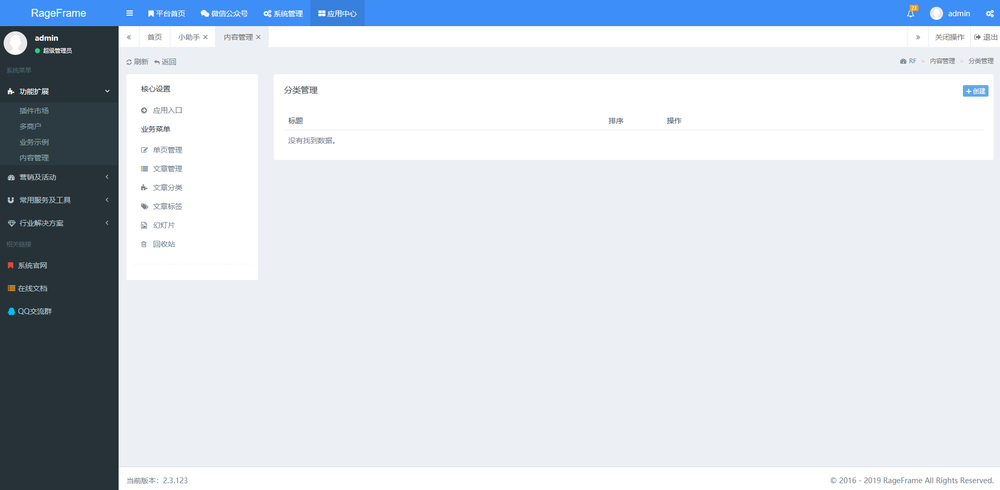

## RageFrame 2.0

为二次开发而生，让开发变得更简单

### 前言

RageFrame创建于2016年4月16日，一个基于Yii2高级框架的快速开发引擎，目前正在成长中，目的是为了集成更多的基础功能，不在为相同的基础功能重复制造轮子，开箱即用，让开发变得更加简单。  
2018年9月10日 2.0版本正式上线，经过1.0版本一年多的开源反馈磨合，以更加优秀的形态出现。对1.0的版本进行了重构优化完善，更好的面向开发者进行二次开发。

### 特色

- 只做基础底层内容，RageFrame不会在上面开发过多的业务内容，满足绝大多数的系统底层开发。
- 基于完善的RBAC权限控制管理、无限父子级权限分组、可自由分配子级权限。
- 多入口模式，多入口分为 backend(后台)、frontend(PC前端)， wechat(微信)，api(其他或app接口对接)， 不同的业务,不同的设备,进入不同的入口。
- 对接微信公众号且支持小程序，使用了一款优秀的微信非官方SDK Easywechat 4.x，开箱即用，预置了绝大部分功能，大幅度的提升了微信开发效率。
- 模块插件机制，安装和卸载不会对原来的系统产生影响,强大的功能完全满足金主爸爸的临时需求，且支持用户多端访问(后台、微信、Api、前台)。
- 整合了第三方登录，目前有QQ、微信、微博、GitHub等等。
- 整合了第三方支付，目前有微信支付、支付宝支付、银联支付。
- 整合了RESTful API，支持前后端分离接口开发和app接口开发，可直接上手开发业务。
- 全面监控系统报错，报错日志写入数据库，方便定位错误信息。
- 快速高效，Servises(服务层) 遵循Yii2的懒加载方式，只初始化使用到的组件服务。
- 封装了常用的扩展组件(生成二维码、Curl、IP地址转地区)和表单控件(时间、时间日期、日期范围选择、颜色选择器、省市区三级联动、单图上传、多图上传、单文件上传、多文件上传、百度编辑器、图表、多文本编辑框)，快速开发，不必在为基础组件而担忧。
- 丰富完善的文档，让你二次开发不在困扰。

### 思维导图

### 系统快照

【首页】

【微信自定义菜单】

【微信关注统计】

【插件模块列表】

【插件模块文章模块】

### 开始之前

- 具备 PHP 基础知识
- 具备 Yii2 基础开发知识
- 具备 开发环境的搭建
- 仔细阅读文档，一般常见的报错可以自行先解决，解决不了在来提问
- 如果要做小程序或微信开发需要明白微信接口的组成，自有服务器、微信服务器、公众号（还有其它各种号）、测试号、以及通信原理（交互过程）
- 如果需要做接口开发(RESTful API)了解基本的 HTTP 协议，Header 头、请求方式（`GET\POST\PUT\PATCH\DELETE`）等
- 能查看日志和Debug技能
- 一定要仔细走一遍文档

### Demo

地址：http://demo2.rageframe.com/backend  
账号：demo  
密码：123456

### 官网

http://www.rageframe.com

### 文档

[安装文档](docs/guide-zh-CN/start-installation.md) · [本地文档](docs/guide-zh-CN/README.md) · [更新历史](docs/guide-zh-CN/start-update-log.md) · [常见问题](docs/guide-zh-CN/start-issue.md)

### 问题反馈

在使用中有任何问题，欢迎反馈给我，可以用以下联系方式跟我交流

QQ群：[655084090](https://jq.qq.com/?_wv=1027&k=4BeVA2r)

Github：https://github.com/jianyan74/rageframe2/issues

### 特别鸣谢

感谢以下的项目,排名不分先后

Yii：http://www.yiiframework.com

EasyWechat：https://www.easywechat.com

Bootstrap：http://getbootstrap.com

AdminLTE：https://adminlte.io

### 版权信息

RageFrame遵循Apache2开源协议发布，并提供免费使用。

本项目包含的第三方源码和二进制文件之版权信息另行标注。

版权所有Copyright © 2016-2019 by RageFrame [www.rageframe.com](http://www.rageframe.com)

All rights reserved。