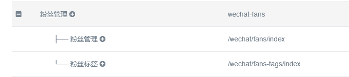
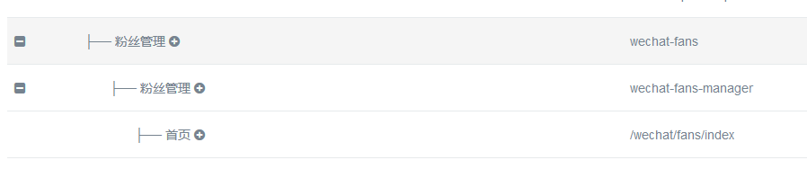
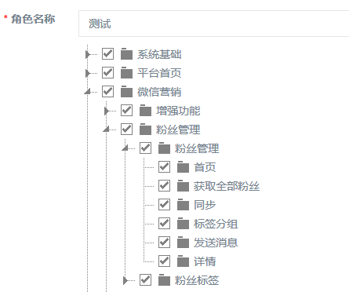

## 权限控制

- 路由控制
- 不进行权限认证的路由
- 不进行权限认证的方法
- 按钮权限控制显示

> RageFrame已经内置Yii2的RBAC权限管理，并对其进行了二次开发，无限父子级权限分组、可自由分配子级权限

### 路由控制

路由和菜单是绑定在一起的，如果出现授权了权限，但是菜单却不显示的情况，检查一下权限的路由是否等于菜单的路由，如果不存在则该菜单会被隐藏  
为了用户的友好度，系统对添加的数据进行了一定的冗余，比如：

**微信公众号-粉丝管理的添加** 
 
菜单的路由为：粉丝管理(菜单别名) => wechat-fans、 粉丝管理(实际路由) => /wechat/fans/index，如图



**系统-用户权限-权限管理的添加** 

权限的路由为：粉丝管理(路由别名) => wechat-fans、 粉丝管理(路由别名) => wechat-fans-manager、 首页(实际路由) => /wechat/fans/index，如图



这里冗余了一个wechat-fans-manager的权限路由，看实际授权的页面



如果我把菜单的路由别名改掉或者吧权限的别名改掉，菜单就不会显示出来

> 注意！！！  
> 注意！！！  
> 注意！！！  
>
> 权限的路由一定要包含菜单路由

### 不进行权限认证的路由

> 修改地址 `backend/config/params` 找到 `noAuthRoute`

```
    /**
     * 不需要验证的路由全称
     *
     * 注意: 前面以绝对路径/为开头
     */
    'noAuthRoute' => [
        '/main/index',// 系统主页
        '/main/system',// 系统首页
        '/ueditor/index',// 百度编辑器配置及上传
        '/menu-provinces/index',// 微信个性化菜单省市区
        '/wechat/common/select-news',// 微信自动回复获取图文
        '/wechat/common/select-attachment',// 微信自动回复获取图片/视频/
        '/wechat/analysis/image',// 微信显示素材图片
        '/sys/style/update',// 系统主题更新
    ],
```

### 不进行权限认证的方法

> 修改地址 `backend/config/params` 找到 `noAuthAction`

```
    // 不需要验证的方法
    'noAuthAction' => [

    ],
```

### 按钮权限控制显示

> TODO
    


