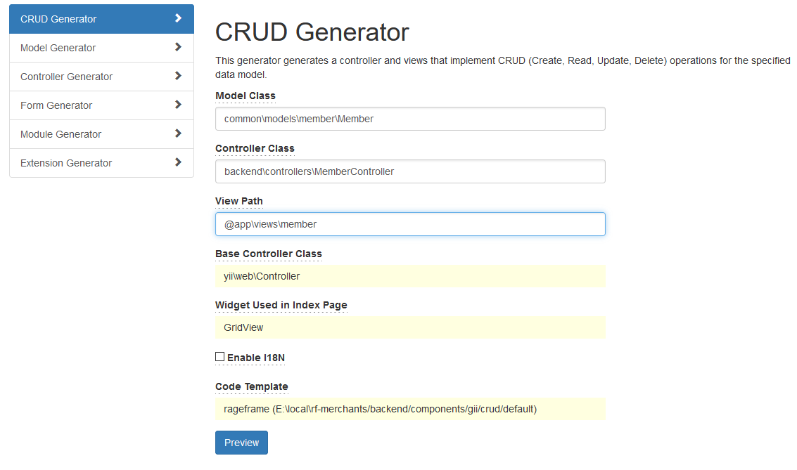
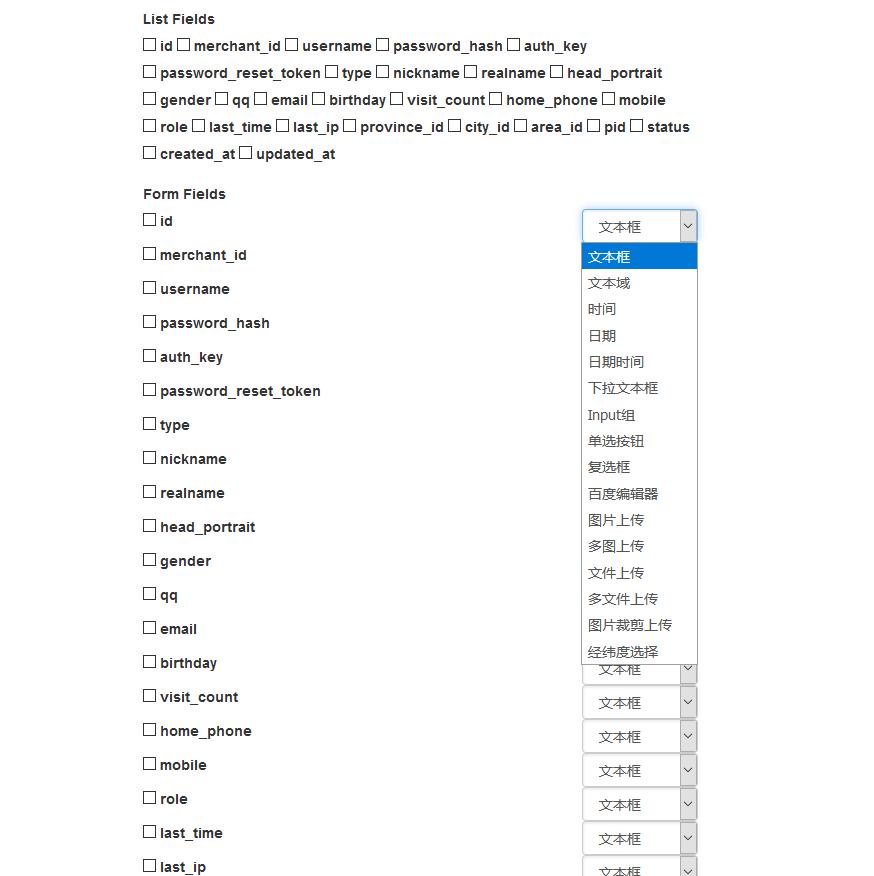
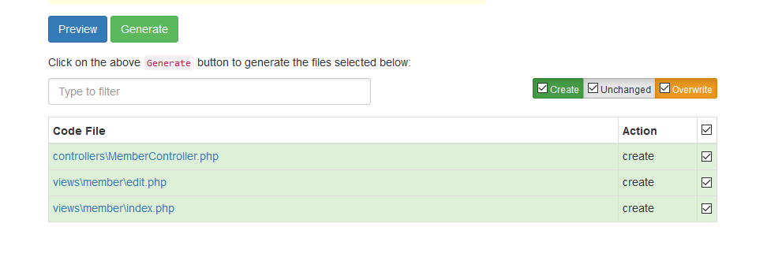

## Gii

目录

- Model
- CURD

使用条件

- 开发模式
- rageframe 版本号 >= 2.3.94
- backend/gii

CURD 使用条件

- 表自增长字段为 `id`
- 表必须带有 `status` 字段
- 控制器必须继承  `backend\controllers\BaseController`

### Model

- 表字段已经备注
- Code Template 选择 rageframe

那么你选择一个表进行生成 Model 你会发现 attributeLabels 全部替换成为字段备注，不用再重新修改

```
<?php

namespace app\models;

use Yii;

/**
 * This is the model class for table "{{%addon_article_adv}}".
 *
 * @property int $id 序号
 * @property string $merchant_id 商户id
 * @property string $title 标题
 * @property string $cover 图片
 * @property int $location_id 广告位ID
 * @property string $silder_text 图片描述
 * @property int $start_time 开始时间
 * @property int $end_time 结束时间
 * @property string $jump_link 跳转链接
 * @property int $jump_type 跳转方式[1:新标签; 2:当前页]
 * @property int $sort 优先级
 * @property int $status 状态
 * @property string $created_at 创建时间
 * @property string $updated_at 更新时间
 */
class AddonArticleAdv extends \yii\db\ActiveRecord
{
    /**
     * {@inheritdoc}
     */
    public static function tableName()
    {
        return '{{%addon_article_adv}}';
    }

    /**
     * {@inheritdoc}
     */
    public function rules()
    {
        return [
            [['merchant_id', 'location_id', 'start_time', 'end_time', 'jump_type', 'sort', 'status', 'created_at', 'updated_at'], 'integer'],
            [['title'], 'string', 'max' => 30],
            [['cover'], 'string', 'max' => 100],
            [['silder_text', 'jump_link'], 'string', 'max' => 150],
        ];
    }

    /**
     * {@inheritdoc}
     */
    public function attributeLabels()
    {
        return [
            'id' => '序号',
            'merchant_id' => '商户id',
            'title' => '标题',
            'cover' => '图片',
            'location_id' => '广告位ID',
            'silder_text' => '图片描述',
            'start_time' => '开始时间',
            'end_time' => '结束时间',
            'jump_link' => '跳转链接',
            'jump_type' => '跳转方式[1:新标签; 2:当前页]',
            'sort' => '优先级',
            'status' => '状态',
            'created_at' => '创建时间',
            'updated_at' => '更新时间',
        ];
    }
}
```

### CURD

1、设置好模型路径(注意是已经创建好的Model)，选择生成控制器命名空间和视图文件路径，选择模板为 rageframe 即可进行生成预览



2、 勾选你首页需要显示的字段和编辑页面需要显示的字段和控件类型即可直接生成一个定制化的 CURD



3、选择后点击 `Preview` 预览，没有问题了可直接点击 `Generate` 创建进行生成



4、访问对应的路径进行查看，这样子关于页面显示、查询、编辑就完成了，就那么简单


